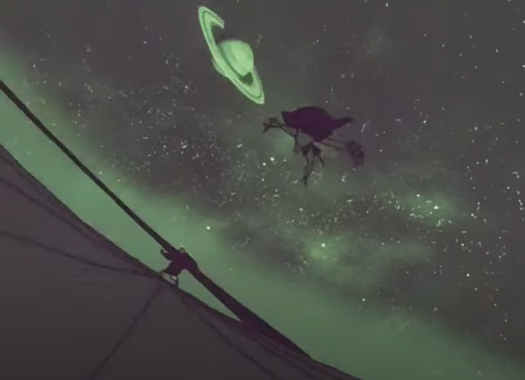

# Guido Nicolás Roces

## Anotado en tecnicatura en programación

## Materias en curso: 
* Programación con objetos I
* Estructura de datos
* Orga I

Me encuentro recursando la materia por no haberme podido presentar a rendir el recuperatorio del segundo parcial, incluso complete el juego con mi grupo,
por ende solo debería refrescar y aprovechar para ampliar lo aprendido en esta cursada con respecto a la anterior.

En cuanto a programación tengo desarrollos con javascript, html, css, react, node y java.

## Intereses:
* Musica.
* Cine.
* Lectura.
* Informática.
* Ciencia.
* Medioambiente.
* Fútbol.
